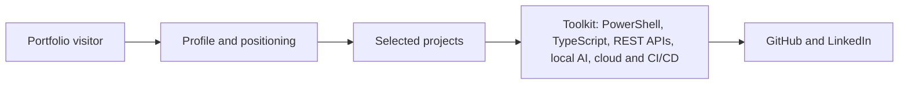

# Alessandro Daudt — portfolio

Static, responsive portfolio landing page built from the public profile at [github.com/AlessandroDaudt](https://github.com/AlessandroDaudt).

The repository root `README.md` is the content rendered on the GitHub profile. `PROFILE_README.md` is retained as its editable mirror, while this file documents the static landing page.

## Run locally

Open `index.html` directly in a browser, or serve the folder with any static HTTP server.

The page has no build dependency and uses only HTML, CSS, and vanilla JavaScript. The avatar is loaded from the public GitHub avatar URL and the typefaces are loaded from Google Fonts.

## Page flow

The hero illustration lives at `assets/automation-hero.png`; the page links to [LinkedIn](https://www.linkedin.com/in/alessandrodaudt/) alongside GitHub.
