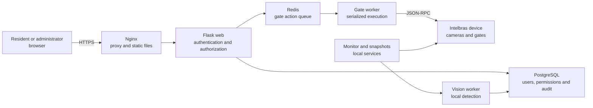

# Intelbras Gatehouse

Flask application for viewing Intelbras cameras, triggering gates through JSON-RPC, managing users, and recording events. The recommended entry point is `proxy.py`.

## Features

- authentication with passwords stored as hashes in SQLite;
- protected sessions, a “remember me” option, logout with token revocation, and CSRF protection;
- per-user authorization for cameras and the administration area;
- snapshots and MJPEG fallback;
- serialized control of gates 1 and 2, with mandatory output shutdown;
- administrative logs and snapshots associated with gate actions;
- Jinja frontend and a static frontend compatible with Nginx.

## System flow



## Requirements

- Python 3.10 or later;
- Chrome or Chromium and a compatible ChromeDriver for DVR authentication;
- network access to the Intelbras device;
- Nginx and HTTPS for production.

## Quick installation

On PowerShell:

```powershell
python -m venv .venv
.\\.venv\\Scripts\\Activate.ps1
python -m pip install -r requirements.txt
Copy-Item .env.example .env
```

On Linux/macOS:

```bash
python3 -m venv .venv
source .venv/bin/activate
python -m pip install -r requirements.txt
cp .env.example .env
```

Edit `.env` and replace every value beginning with `replace-with-`. To generate the Flask key:

```bash
python -c "import secrets; print(secrets.token_urlsafe(48))"
```

The `.env` file contains secrets and must never be committed to Git.

## Initial database

`init_db.py` completely recreates the database. On a new or disposable installation:

1. define users and strong passwords in `SEED_*`;
2. temporarily set `ALLOW_DATABASE_RESET=true`;
3. run `python init_db.py`;
4. set `ALLOW_DATABASE_RESET=false` again.

No default credentials are embedded in the code.

## Running

```powershell
python proxy.py
```

The application starts at `http://127.0.0.1:1000/login`. In production, use:

```bash
gunicorn --bind 127.0.0.1:1000 --workers 1 proxy:app
```

Keep one worker while the device monitor, locks, and caches remain local to the process.

## Essential configuration

| Variable | Purpose |
|---|---|
| `APP_ENV` | Use `production` in production |
| `FLASK_SECRET_KEY` | Random key with at least 32 characters |
| `TRUSTED_HOSTS` | Hosts accepted by Flask |
| `DVR_SCHEME`, `DVR_IP`, `DVR_PORT` | Device address |
| `DVR_USER`, `DVR_PASS` | DVR credentials |
| `DVR_VERIFY_TLS` | Certificate validation when the DVR uses HTTPS |
| `CHROME_BINARY`, `CHROMEDRIVER_PATH` | Optional Selenium binaries |
| `CORS_ALLOWED_ORIGINS` | Explicit origins; empty keeps CORS disabled |

All options are described in [docs/SETUP.md](docs/SETUP.md).

## Structure

- `proxy.py`: main application;
- `templates/` and `static/`: frontend served by Flask;
- `frontend/`: static frontend used by the Nginx configuration;
- `init_db.py`: controlled, destructive SQLite initialization;
- `deploy/` and `nginx/`: deployment examples;
- `python/` and `app.py`: cleaned legacy prototypes outside the main path;
- `docs/`: architecture, API, installation, and deployment documentation.

## Security

Before publishing, read [SECURITY.md](SECURITY.md) and the [review report](security_best_practices_report.md). This system controls physical equipment: use HTTPS, a restricted network, individual accounts, backups, and monitoring. `.env` files, databases, HARs, logs, local PDFs, screenshots, and snapshots are ignored by Git.

## Documentation

Start with the [documentation index](docs/README.md). For contributions, see [CONTRIBUTING.md](CONTRIBUTING.md).
